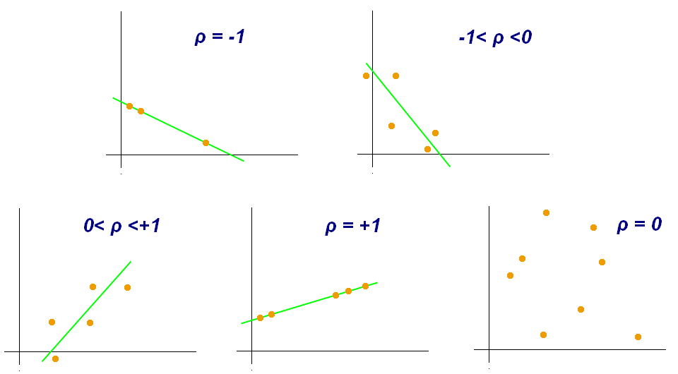

title: NPFL129, Lecture 8
class: title, cc-by-sa
style: .algorithm { background-color: #eee; padding: .5em }
# Correlation, Model Combination

## Jindřich Libovický <small>(reusing materials by Milan Straka)</small>

### November 21, 2023

---
# Course Objectives: Where are we now?

After this course you should…

- Be able to reason about task/problems **suitable for ML**
   - Know when to use classification, regression and clustering
   - Be able to choose from this method Linear and Logistic Regression,
     Multilayer Perceptron, Nearest Neighbors, Naive Bayes, Gradient Boosted Decision
     Trees, $k$-means clustering

- Think about learning as (mostly probabilistic) **optimization on training data**
  - Know how the ML methods learn including theoretical explanation

- Know how to properly **evaluate** ML
  - Think about generalization (and avoiding overfitting)
  - Be able to choose a suitable evaluation metric
  - Responsibly decide what model is better

- Be able to **implement ML algorithms** on a conceptual level
- Be able to **use Scikit-learn** to solve ML problems in Python

---
class: middle
# Today's Lecture Objectives

After this lecture you should be able to

- Explain and implement different ways of measuring correlation: Pearson's
  correlation, Spearman's correlation, Kendall's $\tau$.

- Decide if correlation is a good metric for your model.

- Measure inter-annotator agreement and draw conclusions for data
  cleaning and for limits of your models.

- Use correlation with human judgment to validate evaluation metrics.

- Ensemble models with uncorrelated predictions.

- Distill ensembles into smaller models.

---
section: Covariance
# Covariance

Given a collection of random variables $⁇x_1, …, ⁇x_N$, we know that
$$𝔼\left[∑\nolimits_i ⁇x_i\right] = ∑_i 𝔼 \big[⁇x_i\big].$$

~~~
But how about $\Var\big(∑_i ⁇x_i\big)$?

~~~
$\displaystyle \kern5em\Var\left(∑\nolimits_i ⁇x_i\right)
 = 𝔼\left[\left(∑\nolimits_i ⁇x_i - ∑\nolimits_i 𝔼[⁇x_i]\right)^2\right]$

~~~
$\displaystyle \phantom{\kern5em\Var\left(∑\nolimits_i ⁇x_i\right)}
 = 𝔼\left[\left(∑\nolimits_i \big(⁇x_i - 𝔼[⁇x_i]\big)\right)^2\right]$

~~~
$\displaystyle \phantom{\kern5em\Var\left(∑\nolimits_i ⁇x_i\right)}
 = 𝔼\left[∑\nolimits_i ∑\nolimits_j \big(⁇x_i - 𝔼[⁇x_i]\big) \big(⁇x_j - 𝔼[⁇x_j]\big)\right]$

~~~
$\displaystyle \phantom{\kern5em\Var\left(∑\nolimits_i ⁇x_i\right)}
 = ∑_i ∑_j 𝔼\left[\big(⁇x_i - 𝔼[⁇x_i]\big) \big(⁇x_j - 𝔼[⁇x_j]\big)\right].$

---
# Covariance

We define **covariance** of two random variables $⁇x, ⁇y$ as
$$\Cov(⁇x, ⁇y) = 𝔼\Big[\big(⁇x - 𝔼[⁇x]\big) \big(⁇y - 𝔼[⁇y]\big)\Big].$$

~~~
Then,
$$\Var\left(∑\nolimits_i ⁇x_i\right) = ∑_i ∑_j \Cov(⁇x_i, ⁇x_j).$$

~~~
Note that $\Cov(⁇x, ⁇x) = \Var(⁇x)$ and that we can write covariance as
$$\begin{aligned}
  \Cov(⁇x, ⁇y)
   &= 𝔼\Big[\big(⁇x - 𝔼[⁇x]\big) \big(⁇y - 𝔼[⁇y]\big)\Big] \\
   &= 𝔼\big[⁇x ⁇y - ⁇x 𝔼[⁇y] - 𝔼[⁇x] ⁇y + 𝔼[⁇x] 𝔼[⁇y]\big] \\
   &= 𝔼\big[⁇x ⁇y\big] - 𝔼\big[⁇x\big] 𝔼\big[⁇y\big].
\end{aligned}$$

---
section: Correlation
# Correlation

Two random variables $⁇x, ⁇y$ are **uncorrelated** if $\Cov(⁇x, ⁇y) = 0$;
otherwise, they are **correlated**.

~~~
Note that two _independent_ random variables are uncorrelated, because

$\displaystyle \kern10em\mathllap{\Cov(⁇x, ⁇y)} = 𝔼\Big[\big(⁇x - 𝔼[⁇x]\big) \big(⁇y - 𝔼[⁇y]\big)\Big]$

~~~
$\displaystyle \kern10em{} = ∑_{x,y} P(x, y) \big(x - 𝔼[x]\big) \big(y - 𝔼[y]\big)$

~~~
$\displaystyle \kern10em{} = ∑_{x,y} P(x) \big(x - 𝔼[x]\big) P(y) \big(y - 𝔼[y]\big)$

~~~
$\displaystyle \kern10em{} = ∑_x P(x) \big(x - 𝔼[x]\big) ∑_y P(y) \big(y - 𝔼[y]\big)$

~~~
$\displaystyle \kern10em{} = 𝔼_⁇x \big[⁇x - 𝔼[⁇x]\big] 𝔼_⁇y \big[⁇y - 𝔼[⁇y]\big] = 0.$

~~~
However, dependent random variables can be uncorrelated – random
uniform $⁇x$ on $[-1, 1]$ and $⁇y = |⁇x|$ are not independent ($⁇y$ is
completely determined by $⁇x$), but they are uncorrelated.

---
# Pearson correlation coefficient

There are several ways to measure correlation of random variables $⁇x, ⁇y$.

**Pearson correlation coefficient**, denoted as $ρ$ or $r$, is defined as
$$\begin{aligned}
  ρ &≝ \frac{\Cov(⁇x, ⁇y)}{\sqrt{\Var(⁇x)} \sqrt{\Var(⁇y)}} \\
  r &≝ \frac{∑_i (x_i - x̄) (y_i - ȳ)}{\sqrt{∑_i (x_i - x̄)^2} \sqrt{∑_i (y_i - ȳ)^2}},
\end{aligned}$$
where:
~~~
- $ρ$ is used when the full expectation is computed (population Pearson
  correlation coefficient);
~~~
- $r$ is used when estimating the coefficient from data (sample Pearson
  correlation coefficient);
  - $x̄$ and $ȳ$ are sample estimates of the respective means.

---
class: dbend
# Pearson correlation coefficient

The value of Pearson correlation coefficient is in fact normalized covariance,
because its value is always bounded by $-1 ≤ ρ ≤ 1$ (and the same holds for $r$).

~~~
The bound can be derived from

$\displaystyle \kern5em\mathllap{0} ≤ 𝔼\bigg[\bigg(\frac{(⁇x - 𝔼[⁇x])}{\sqrt{\Var(⁇x)}} - ρ\frac{(⁇y - 𝔼[⁇y])}{\sqrt{\Var(⁇y)}}\bigg)^2\bigg]$

~~~
$\displaystyle \kern5em{} = 𝔼\bigg[\frac{(⁇x - 𝔼[⁇x])^2}{\Var(⁇x)}\bigg]
                            - 2ρ𝔼\bigg[\frac{(⁇x - 𝔼[⁇x])}{\sqrt{\Var(⁇x)}}\frac{(⁇y - 𝔼[⁇y])}{\sqrt{\Var(⁇y)}}\bigg]
                            + ρ^2 𝔼\bigg[\frac{(⁇y - 𝔼[⁇y])^2}{\Var(⁇y)}\bigg]$

~~~
$\displaystyle \kern5em{} = \frac{\Var(⁇x)}{\Var(⁇x)} - 2ρ⋅ρ + ρ^2 \frac{\Var(⁇y)}{\Var(⁇y)} = 1 - ρ^2,$

~~~
which yields $ρ^2 ≤ 1$.

---
# Pearson correlation coefficient

Pearson correlation coefficient quantifies **linear dependence** of the two
random variables.

---
# Pearson correlation coefficient

Pearson correlation coefficient quantifies **linear dependence** of the two
random variables.

---
# Pearson correlation coefficient

The four displayed variables have the same mean 7.5, variance 4.12,
Pearson correlation coefficient 0.816 and regression line $3 + \frac{1}{2}x$.

---
# Nonlinear Correlation – Spearman's $ρ$

To measure also nonlinear correlation, two coefficients are commonly used.

### Spearman's rank correlation coefficient $ρ$
Spearman's $ρ$ is Pearson correlation coefficient measured on **ranks** of the
original data, where a rank of an element is its index in sorted ascending
order.

---
# Nonlinear Correlation – Kendall's $τ$

### Kendall rank correlation coefficient $τ$
Kendall's $τ$ measures the amount of _concordant pairs_ (pairs where $y$
increases/decreases when $x$ does), minus the _discordant pairs_
(where $y$ increases/decreases when $x$ does the opposite):

$$\begin{aligned}
  τ &≝ \frac{|\{\mathrm{pairs}~i ≠ j: x_j > x_i, y_j > y_i\}| - |\{\mathrm{pairs}~i ≠ j: x_j > x_i, y_j < y_i\}|}{\binom{n}{2}} \\
    &= \frac{∑_{i < j} \sign(x_j - x_i) \sign(y_j - y_i)}{\binom{n}{2}}.
\end{aligned}$$

~~~
There is no clear consensus whether to use Spearman's $ρ$ or Kendall's $τ$.
When there are no/few ties in the data, Kendall's $τ$ offers two minor
advantages – $\frac{1+τ}{2}$ can be interpreted as a probability of
a concordant pair, and Kendall's $τ$ converges to a normal distribution faster.

~~~
As defined, the range of Kendall's $τ ∈ [-1, 1]$. However, if there are ties,
its range is smaller – therefore, several corrections (not discussed here) exist
to adjust its value in case of ties.

---
class: middle
# Correlation is not causation

---
section: CorrelationUsed
# Use of Correlation in Machine Learning

In ML, correlation is commonly used as

- Evaluation metric for some tasks;

- Measuring data annotation quality;

- Assessing the quality of automatic metrics by comparing it to human judgment.

---
# Correlation as evaluation metric

- Learning to rank (e.g., document retrieval): we do not care about the actual values

   - Kendall's $\tau$, Spearman's correlation

   - When we want the correct items to rank before incorrect ones: precision
     (assuming fixed top-$k$, typically at 5, 10), recall (often ill-defined),
     mean reciprocal rank

   $$\operatorname{MRR} = \frac{1}{N}\sum_{i=1}^{N}\frac{1}{\text{rank of the first relevant item}}$$
~~~
- Evaluating pair similarity: word embeddings, sentence embeddings

   - Similarity estimates from psycholinguistic experiments: scores for word/sentence pairs

   - Measure Pearson/Spearman correlation between embedding distances and similarity scores

---
# Inter-annotator agreement (1)

- Inter-annotator agreement can tell us

   - How well defined the task is

   - How reliable annotators/user ratings are

   - What data items are suspicious / difficult

 
~~~

- For continuous target values: Pearson's/Spearman's correlation

~~~

- For classification tasks: Cohen's $\kappa$ \
    $p_O$ is observed agreement, $p_E$ expected agreement by chance

$$\kappa = \frac{p_O - p_E}{1 - p_E}$$

---
# Inter-annotator agreement (2)

- Can be used to filter out confusing data points and unreliable annotators

- Not all outliers are noise! Low IAA can reveal cultural differences.

 
 

~~~
IAA sets natural upper boundary for ML performance. Performance over IAA is
suspicious!

 

~~~
* Trivial baseline for classification: majority class, for regression average,
  or something based on simple rules

* Performance over IAA is more likely overfitting for the way the data is
  curated than super-human performance.

---
# Correlation with human judgment

For some tasks, it might not be clear how to measure the model performance:

**Grammar checking**: the $\beta$ parameter

~~~

**Machine translation**: evaluation is subjective by definition, we design
metrics to correlate with human judgment.

- SoTA machine translation metrics are typically machine-learned.

- Different metrics might be suitable different tiers of translation quality.

- There is an annual competition in MT quality and MT metric quality.

---
section: Model Combination
# Model Combination aka Ensembling

The goal of **ensembling** is to combine several models in order to reach
higher performance.

~~~
The simplest approach is to train several independent models and then to combine
their predictions by averaging or voting.

~~~
The terminology varies, but for classification:
- voting (or hard voting) usually means predicting the class predicted most
  often by the individual models,
~~~
- averaging (or soft voting) denotes averaging the returned model distributions
  and predicting the class with the highest probability.

~~~
The main idea behind ensembling is that if models have uncorrelated
errors, then by averaging model predictions the errors will cancel out.

---
# Visualization of Ensembling Performance

Consider ensembling predictions generated uniformly on a planar disc:

~~~

~~~

---
# Model Combination aka Ensembling

If we denote the prediction of a model $y_i$ on a training example $(→x, t)$ as
$y_i(→x) = t + ε_i(→x)$, so that $ε_i(→x)$ is the model error on example $→x$,
the mean square error of the model is
$$𝔼\big[(y_i(→x) - t)^2\big] = 𝔼\big[ε_i^2(→x)\big].$$

~~~
Considering $M$ models, we analogously get that the mean square error
of the ensemble is
$$𝔼\bigg[\Big(\frac{1}{M} ∑\nolimits_i ε_i(→x)\Big)^2\bigg].$$

~~~
Finally, assuming that the individual errors $ε_i$ have zero mean and are _uncorrelated_,
we get that $𝔼\big[ε_i(→x) ε_j(→x)\big] = 0$ for $i ≠ j$, and therefore,
~~~
$$𝔼\Big[\Big(\frac{1}{M} ∑\nolimits_i ε_i(→x)\Big)^2\Big]
= 𝔼\Big[\frac{1}{M^2} ∑\nolimits_{i,j} ε_i(→x) ε_j(→x)\Big]
= \frac{1}{M} 𝔼\Big[\frac{1}{M} ∑\nolimits_i ε_i^2(→x)\Big],$$
~~~
so the average error of the ensemble is $\frac{1}{M}$ times the average error
of the individual models.

---
# Bagging – Bootstrap Aggregation

For neural network models, training models with independent random initialization is
usually enough, given that the loss has many local minima, so the models tend to
be quite independent just when using different random initialization.

~~~
However, algorithms with convex loss functions usually converge to the same
optimum independent of randomization.

~~~
In these cases, we can use **bagging**, which stands for **bootstrap
aggregation**.

~~~

In bagging, we construct a different dataset for every model we train.
We construct it using **bootstrapping** – we sample as many training instances
as the original dataset has, but **with replacement**.

Such dataset is sampled using the same empirical data distribution and has the
same size, but is not identical.

---
# Knowledge Distillation

- Model ensemble might be too slow or too big to use.

~~~

- Knowledge distillation = training a **student** model that mimics behaviour
  of a **teacher model** (a bigger one or model ensemble).

~~~

**Algorithm:**

1. Process training data (or additional unlabelled data) with the best current
   model and get the output distribution $p_\text{teacher}(\boldsymbol y |
   \boldsymbol x; \boldsymbol w )$ (sometimes called _pseudolikelihood_)

2. Train a model with $H\left(p_\text{student}(\boldsymbol y | \boldsymbol x;
   \boldsymbol w), p_\text{teacher}(\boldsymbol y | \boldsymbol x; \boldsymbol
   w )\right)$ as a training objective.

~~~
**Intuition:** Complete distribution provides stronger supervision that just
one-hot target, so it is easier for the smaller model to learn from such
synthetic data.

~~~
 

<small>Historical note: Term knowledge distillation come from a 2015 by
Geoffrey Hinton et al., before a similar approach was called model
compression.</small>

---
class: middle
# Today's Lecture Objectives

After this lecture you should be able to

- Explain and implement different ways of measuring correlation: Pearson's
  correlation, Spearman's correlation, Kendall's $\tau$

- Decide if correlation is a good metric for your model

- Measure inter-annotator agreement and draw conclusions for data cleaning and
  for limits of your models

- Use correlation with human judgment to validate evaluation metrics

- Ensemble models with uncorrelated predictions

- Distill ensembles into smaller models.

